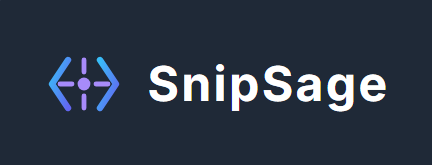

SnipSage: Your AI Code Assistant

<strong>Understand, validate, and improve your code faster than ever before with the power of the Google Gemini API directly in your editor.</strong>

What is SnipSage?
SnipSage is a VS Code extension that acts as your personal AI-powered assistant. It's designed to accelerate your workflow by helping you decipher complex code, ensure its quality, and improve its structure, all without leaving your editor. Whether you're navigating a new codebase or polishing your own work, SnipSage provides the insights you need, right when you need them.

Features
SnipSage is a multi-tool for developers, offering a suite of commands to supercharge your coding sessions.

Explain Code
Instantly get a clear, human-readable explanation of any code snippet. Just select the code, run the "Explain" command, and hover to see the insights.

(Recommended: Insert a short GIF here showing the select -> run command -> hover workflow)

Generate Unit Tests
Stop writing boilerplate test code. Select a function or class, and SnipSage will generate a complete unit test file, saved directly into your workspace with the correct module imports.

(Recommended: Insert a short GIF here showing a function being selected and a new test file being created and opened)

Refactor & Improve Code
Clean up complex functions and improve code quality. SnipSage can refactor your selected code to be more efficient, readable, and idiomatic according to language best practices.

(Recommended: Insert a short GIF here showing a messy function being selected and then replaced by a cleaner version)

Document Your Code (Add Comments & Docstrings)
Eliminate the tedious task of documentation. SnipSage can automatically add helpful, inline comments to your code or generate a complete, professional docstring for any function or class.

(Recommended: Insert a short GIF here showing a function being selected and then having comments or a docstring added to it)

How to Use
Install the Extension: Find "SnipSage" in the VS Code Marketplace and click "Install".

Set Your API Key: The first time you run any SnipSage command, you will be prompted to enter your Google Gemini API key. This is a one-time setup; the key will be securely stored in your settings.

You can get a free Gemini API key from Google AI Studio.

Select & Run:

Highlight a block of code in your editor.

Open the Command Palette (Ctrl+Shift+P or Cmd+Shift+P).

Type SnipSage to see the list of available commands and choose the one you need!

Configuration
snipsage.apiKey: Your Google Gemini API key. The extension will prompt you for this, but you can also set it manually in your VS Code settings (settings.json).

Built With
TypeScript & Node.js

Visual Studio Code API

Google Gemini API (gemini-2.0-flash)

Contributing
Contributions are what make the open-source community such an amazing place to learn, inspire, and create. Any contributions you make are greatly appreciated. Please feel free to fork the repo and create a pull request.

License
Distributed under the MIT License. See LICENSE for more information.