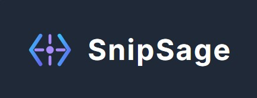

SnipSage: Your AI Code Assistant
SnipSage is a VS Code extension that brings the power of the Google Gemini API directly into your editor, helping you understand, validate, and improve your code faster than ever before.

About The Project
SnipSage is a multi-tool for developers, offering a suite of commands to accelerate your workflow. It can explain complex code in plain English, generate complete unit tests, add helpful inline comments, refactor code for better performance and readability, and even generate professional docstrings. It’s a seamless assistant that feels like a native part of the development workflow, inspired by the universal challenge of deciphering complex and unfamiliar code.

Features
- Explain Code: Select any code snippet and run the Explain Selection command. An explanation is generated and appears instantly when you hover over the code, with an option to open it in a side panel for detailed review.
- Generate Unit Tests: Automatically creates test files for your functions and classes, with the correct module imports, saved directly into your workspace.
- Add Comments: Instantly adds helpful, inline comments to your selected code to improve readability for you and your team.
- Refactor Code: Improves the quality of your code by refactoring it for better efficiency, readability, and adherence to best practices.
- Generate Docstrings: Automatically creates professional, language-appropriate docstrings for your functions and classes.
- Secure API Key Handling: Prompts for your Gemini API key on first use and stores it securely in your VS Code settings.

Built With
- Languages: TypeScript
- Frameworks/Platforms: Node.js, VS Code Extension API
- APIs: Google Gemini API (gemini-2.0-flash)
- Tools: vsce (for packaging), Git & GitHub

Installation & Usage
Prerequisites
You will need a Google Gemini API key. You can get a free key from Google AI Studio.

Installation Steps
Option 1:
- Clone the repo in your local coding environment.
- Open terminal and run "npm install" to install packages from package.json
- Press F5 to run the extension
- A new VS Code window will open. Open any code file to test the extension. See How to Use section for more info.

Option 2: (Not sure whether this will work or not)
- Navigate to the Releases page of this repository. (Replace with your actual link)
- Download the latest snipsage-x.x.x.vsix file.
- In VS Code, go to the Extensions view (Ctrl+Shift+X).
- Click the ... menu at the top of the panel and select "Install from VSIX...".
- Choose the .vsix file you just downloaded.

How to Use
- The first time you run a SnipSage command, you will be prompted to enter your Google Gemini API key. This will be securely saved for future use.
To Explain Code:
- Select a block of code.
- Open the Command Palette (Ctrl+Shift+P) and run SnipSage: Explain Selection (for Hover).
- Hover over the selected code to see the explanation.

For Other Features:
- Select a block of code.
- Open the Command Palette and choose any of the other SnipSage commands (Generate Unit Test, Refactor Selection, etc.).
